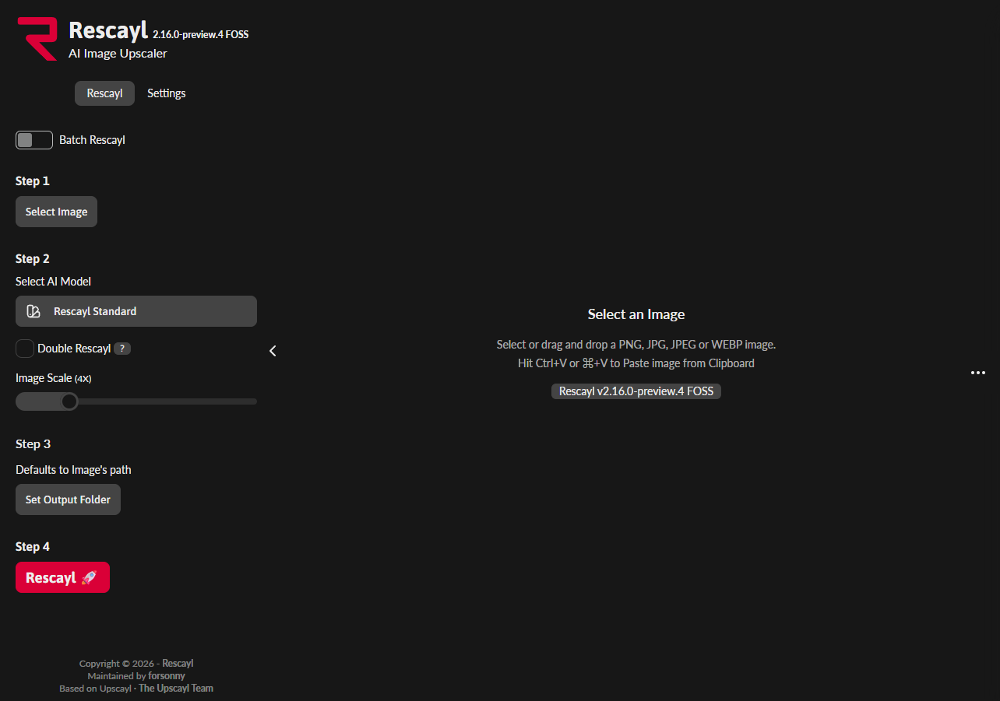

<p align="center">
  
</p>

<h1 align="center">Rescayl</h1>

<p align="center"><strong>More detail. More to keep.</strong></p>

<p align="center">
  <a href="#try-rescayl">Try Rescayl</a> ·
  <a href="#use-rescayl">Use Rescayl</a> ·
  <a href="#develop-rescayl">Develop Rescayl</a> ·
  <a href="#roadmap">Roadmap</a>
</p>

Rescayl is a free, open-source desktop app for upscaling your photos, artwork, screenshots, and everyday images. Image processing runs locally on your computer.

Maintained by [forsonny](https://github.com/forsonny), Rescayl is an independent fork of [Upscayl](https://github.com/upscayl/upscayl), with its own branding and Windows-first release plan.



## What you can do

The current app focuses on image upscaling:

- Process a single image or a folder of images
- Choose built-in models for photos and digital artwork
- Compare the original and processed image inside the app
- Save results as PNG, JPG, or WebP
- Adjust scale, output size, compression, and metadata settings
- Load compatible custom models

Rescayl accepts PNG, JPG, JPEG, JFIF, and WebP input images. Results depend on the source image and model, so review fine details before keeping an output.

## Try Rescayl

Windows x64 is the primary release target. Check the [Rescayl releases page](https://github.com/forsonny/Rescayl/releases) for available builds.

**Current status:** `2.16.0-preview.5` is being prepared as a draft prerelease. Its Windows installer is not a public download yet. You can [run Rescayl from source](#develop-rescayl) while public downloads are pending.

When a Windows preview is available to you, choose one format:

- **Installer:** download `rescayl-<version>-win.exe` and follow its installation steps
- **ZIP, when offered:** extract `rescayl-<version>-win.zip` and launch `Rescayl.exe`

Windows previews are unsigned and use manual updates. Automatic updates are disabled during this preview stage.

| Platform | Status |
| --- | --- |
| Windows x64 | Primary target; installer preview prepared |
| Linux | Docker build and software Vulkan validation available; desktop testing pending |
| macOS | Inherited packaging configuration; no validated Rescayl release |

### Hardware requirements

The [regular upscaler](https://github.com/upscayl/upscayl-ncnn) requires compatible Vulkan support and graphics drivers. The optional Windows Detail preview uses DirectML with DirectX 12 graphics support. Compatibility depends on your hardware; a CPU-only desktop workflow has not been validated.

## Use Rescayl

Once the app is running, follow the image workflow:

1. Click **Select Image**, drag an image into the workspace, or paste an image with **Ctrl+V**.
2. Choose an enhancement. **Rescayl Standard** is the default starting point.
3. Set the scale and output folder. Choose your saved image format in **Settings**.
4. Click **Upscale** in Step 4 to process the image.
5. Review the before/after view and find the saved result in the output folder.

Turn on **Process a folder** to upscale a folder of images. Additional output controls are in **Settings**, with specialist controls under **Advanced processing**.

For small, clear photos and artwork, **Detail preview** offers an alternative 4× PNG result. **Preview options** contains the image limits and graphics processor choice. Standard remains the default enhancement.

For help with a Rescayl problem, [open an issue in this fork](https://github.com/forsonny/Rescayl/issues). Find the app version in **About Rescayl**, and system information and logs in **Settings → Troubleshooting**.

## Roadmap

Development stays focused on the image-upscaling experience first:

- Test output quality with real photos, artwork, and screenshots
- Refine model guidance and the preview/output workflow
- Stabilize Windows releases, then validate the Linux desktop app
- Add trusted signing and automatic updates for future releases

Video upscaling and image vectorization are future capabilities. They are not available in the current preview.

## Develop Rescayl

Use **Node.js 24.21.0**, npm, and Git. Run commands from the repository folder.

Clone this fork and install its locked dependencies:

```powershell
git clone https://github.com/forsonny/Rescayl.git
cd Rescayl
npm ci
```

### Run the development app

From the repository folder, compile and start the development app:

```powershell
npm run start
```

`npm run start` compiles the main/preload code, starts the renderer on port `8000`, and opens Electron.

### Check the source and build the renderer

These commands verify native resources, run the existing tests, and build the production renderer:

```powershell
npm run verify-native
npm test
npm run build
```

### Build an unsigned Windows preview

On Windows, build the renderer and package x64 installer/ZIP artifacts without publishing:

```powershell
npm run build
$env:CSC_IDENTITY_AUTO_DISCOVERY = "false"
npx --no-install electron-builder --win --x64 --publish never
```

The packages appear in `dist/`. A signed Windows build uses `npm run dist:win:signed` and requires a configured code-signing certificate.

### Validate the Linux build in Docker

With Docker running, use the repository's validation image:

```powershell
docker build -f Dockerfile.validation -t rescayl-validation:local .
```

This checks the Linux build, existing tests, a native upscale using software Vulkan, and ZIP packaging. It does not validate a Linux desktop session or your physical GPU.

## Credits and license

Rescayl retains Upscayl's original authorship and open-source foundation:

- **Upscayl:** originally created by Nayam Amarshe and TGS963
- **Native engine:** [Upscayl-NCNN](https://github.com/upscayl/upscayl-ncnn), based on NCNN and [Real-ESRGAN](https://github.com/xinntao/Real-ESRGAN), with research by Xintao Wang
- **Upstream contributors:** @JanDeDinoMan, @xanderfrangos, @Fdawgs, @keturn, and @aaronliu0130
- **Upstream model creators:** Helaman ([HFA2k / High Fidelity](https://openmodeldb.info/models/4x-HFA2k)), Foolhardy ([Remacri](https://openmodeldb.info/models/4x-Remacri)), and Kim2091 ([UltraSharp](https://openmodeldb.info/models/4x-UltraSharp) and Ultramix Balanced)
- **Original Upscayl artwork:** @NicKoehler

The application uses the [GNU Affero General Public License v3.0](LICENSE). Original copyright and license notices remain in the repository.

Original Upscayl copyright: © 2023 Upscayl, by Nayam Amarshe and TGS963.

Bundled [Asap](renderer/fonts/asap/OFL.txt) and [Lato](renderer/fonts/lato/OFL.txt) fonts retain their own licenses. The [native resource manifest](resources/native-manifest.json) records binary and model provenance.
